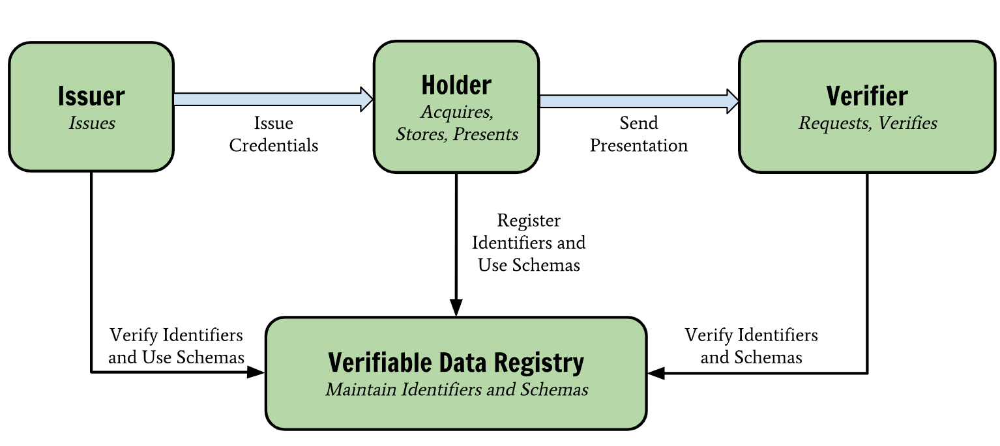
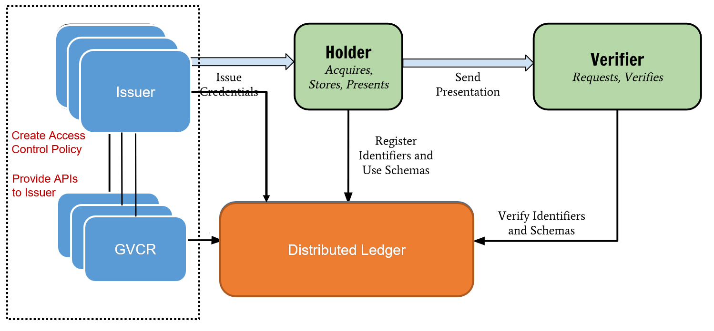

## Release History

| Version   |    Release Date       | Status         |
|-----------|-----------------------|----------------|
|  0.0.1    |    Nov 11, 2021       | Active         |

# Introduction

**DID Registry Manager** (**DRman**), is a command line utility that can create a secure **DID Registry** on GitHub or GitLab, namely **GVCR**.  **DID registry** is a type of **verifiable data registry** that can be simply referred to as a role, a system performs to mediate the functionalities like create, verify, update, and deactivate the decentralized identifiers. The project aims to automate the process of creating a secure DID Registry on GitHub/GitLab, facilitating easy on-boarding of new organizations and enabling easy management. 

**Decentralized ID** (**DID**) tokens or we can call cryptographically-generated proofs of the organizations can be stored in the verifiable credential registries in an encrypted fashion to achieve the secure DID registry with zero infrastructure cost. The shell script integrated in DRman is used to create the initial codebase. 

The main features of the DRman implemented in this project are Creation, Onboarding(Enable/Restrict Access), and Management(add/update/revoke).

## Verifiable Credential Registry Overview 
Th Verifiable Credential Registry model published by W3C describes the roles of the core actors and the relationships between them in an ecosystem where verifiable credentials are expected to be useful. 

Holder: A role an entity might perform by possessing one or more verifiable credentials and generating verifiable presentations from them. Example holders include students, employees, and customers.

Issuer: A role an entity performs by asserting claims about one or more subjects, creating a verifiable credential from these claims, and transmitting the verifiable credential to a holder. Example issuers include corporations, non-profit organizations, trade associations, governments, and individuals.

Verifier: A role an entity performs by receiving one or more verifiable credentials, optionally inside a verifiable presentation, for processing. Example verifiers include employers, security personnel, and websites.

verifiable data registryA role a system might perform by mediating the creation and verification of identifiers, keys, and other relevant data, such as verifiable credential schemas, revocation registries, issuer public keys, and so on, which might be required to use verifiable credentials. Some configurations might require correlatable identifiers for subjects. Example verifiable data registries include trusted databases, decentralized databases, government ID databases, and distributed ledgers. Often there is more than one type of verifiable data registry utilized in an ecosystem.

For more detail, please check [Verifiable Credentials Data Model v1.1](https://www.w3.org/TR/vc-data-model/)

In our architecure of the Verifiable Vredential Registry model, we use GVCR and Distributed ledger as the verifiable data registry. Below is the updated architurece with our GVCR. In this model, there are mutiple issuers for a orginazaiton. Each issuer has one GVCR instance, while the issuer can create access control policy for user access control, and GVCR provides APIs to issuer. The Distributd Ledger can used to store the transactions and public keys of the issuers which used to verfiable the issued DID. 

## Problems that GVCR can solve 
- An underlying system or network used to store/record DIDs. 
- An underlying system support returning data necessary to produce DID documents. 
- Utilizing existing cryptographic open-source data storage solution as trusted data storage, such as GitHub/GitLab.

## Use Cases 
There are four use cases for our DRman and three actors involved. 

## Workflow 

Three internal workflows of DRman, 
1. An admin in an assiocaition AS1, use DRman to create the repository of AS1 for stroing users' DIDs. The admin is the issuer role of the verifiable credential model. 

2. The process of a user BOB to request a DID. Bob is the holder role of the verifiable credential model. 

3. A digital service provider verify the Bob's DID. The digital service provides represents the verifier role of the verifiable credential model. 

## DRman - Core Specification

The core specification defines APIs for the following workflow inside the organization, 

1. **Creation** (of DIDRegistry): Function to create a DIDRegistry for an organization on Github. GitHub Organization can have multiple repositories, same is the case with DID Registries.

2. **Onboarding**: Function to add enable/restrict access to members of an organization to a repository (GitHub repo users can be made members of an Organization, with different roles and privileges).

3. **Manage**: Function to list APIs that are needed to add/update/revoke access DID’s or (DID Documents) saved as files on the repo.

# Acknowledgments
The project is part of a Hyperledger Mentorship Program, which can access through [Hyperledger Mentorship Program Wiki](https://wiki.hyperledger.org/pages/viewpage.action?pageId=41594660)